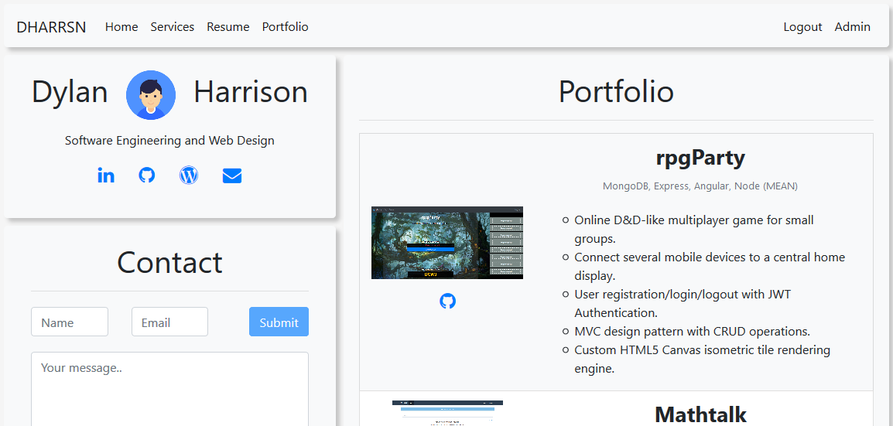

# [dharrsn.com](https://www.dharrsn.com)

## Portfolio Website

### Features
- Single page application with responsive layout for desktop, tablet, and mobile devices.
- Interactive, as-you-type schema based client-side form validation, and schema based server-side data validation.
- Login/logout and guard routes with token based authentication system.
- Admin panel with image upload and full create, read, update, and delete (CRUD) functionality for services and portfolio items with interactive, as-you-type previews.
- Deployed to Hostgator shared hosting: [dharrsn.com](https://www.dharrsn.com)

### Technologies
- Angular
- PHP
- MySQL

